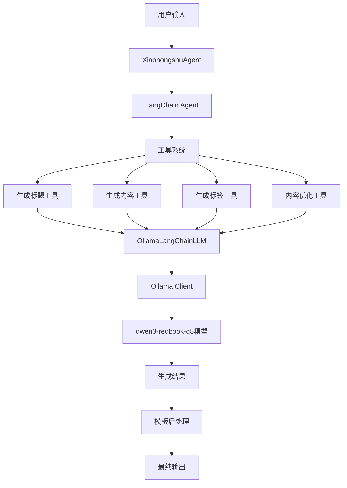

# 小红书文案生成智能体 🎉

基于LangChain和Ollama构建的智能小红书文案生成工具，支持多种内容类型、智能对话、模板库等功能。

[](https://www.python.org/)
[](https://langchain.com/)
[](https://ollama.ai/)
[](https://streamlit.io/)

## 📋 目录

- [功能特色](#功能特色)
- [项目结构](#项目结构)  
- [快速开始](#快速开始)
- [使用指南](#使用指南)
- [功能演示](#功能演示)
- [开发说明](#开发说明)
- [故障排除](#故障排除)

## 🎯 功能特色

### 🏷️ 多分类内容生成
- **美妆护肤** 💄：护肤心得、化妆技巧、产品测评
- **时尚穿搭** 👗：穿搭攻略、服装搭配、时尚趋势  
- **美食探店** 🍽️：餐厅推荐、美食评测、料理分享
- **旅行攻略** ✈️：景点推荐、旅游路线、出行贴士
- **生活方式** 🌱：日常分享、生活技巧、居家指南
- **健身运动** 💪：运动教程、健身心得、体能训练
- **家居装饰** 🏠：装修灵感、家具推荐、收纳技巧
- **学习分享** 📚：学习方法、知识总结、技能提升
- **职场干货** 💼：职业发展、工作技巧、面试经验
- **好物推荐** 🛍️：产品评测、购物指南、性价比分析

### 🎨 丰富的模板库
- **标题模板**：各分类专门的吸引人标题格式
- **内容模板**：开头、结尾、完整结构模板
- **话题标签**：热门相关标签自动生成
- **随机模板**：获取随机模板激发创意

### 💬 智能对话交互
- **LangChain Agent**：基于工具的智能对话系统
- **上下文记忆**：支持多轮对话和历史记录
- **专业工具**：标题生成、内容创作、标签推荐、内容优化

### 🎯 内容优化建议
- **智能分析**：从多个维度分析文案质量
- **优化建议**：提供具体的改进建议和修改方案
- **A/B对比**：展示优化前后的对比效果

### 💡 热门主题推荐
- **分类推荐**：根据选择的分类推荐热门主题
- **实时更新**：基于当前热点生成推荐内容
- **创意激发**：帮助用户找到创作灵感

### 🌊 流式响应体验
- **实时生成**：流式显示文案生成过程，即时反馈
- **流式对话**：对话内容逐字显示，自然交互体验
- **智能状态**：显示连接、思考、生成等不同阶段状态
- **可配置**：支持开启/关闭流式模式，适应不同偏好

### 🚀 多种使用方式
- **Web界面**：基于Streamlit的友好用户界面，支持流式响应
- **命令行**：功能完整的命令行演示程序
- **API调用**：支持Python代码直接调用

## 📁 项目结构

```
Qwen3TORedbook/
├── Agent/                          # 智能体核心模块
│   ├── __init__.py                # 包初始化
│   ├── xiaohongshu_agent.py       # 主要智能体类
│   ├── content_templates.py       # 内容模板库
│   └── web_interface.py           # Streamlit Web界面
├── LLM/                           # 大语言模型客户端
│   ├── ollama_client.py           # Ollama客户端实现
│   └── README.md                  # LLM模块说明
├── docs/                          # 文档目录
│   ├── README.md                  # 文档索引
│   ├── features/                  # 功能特性文档
│   ├── api/                       # API相关文档
│   └── development/               # 开发记录文档
├── fastapi_server.py              # FastAPI服务器
├── start_api.py                   # API启动脚本
├── start_web.py                   # Web界面启动脚本
├── requirements.txt               # 项目依赖包
└── README.md                     # 项目主说明文档
```

## 🚀 快速开始

### 1. 环境准备

确保您的系统已安装：
- Python 3.8+
- Ollama

### 2. 安装Ollama

#### Windows/macOS/Linux:
访问 [Ollama官网](https://ollama.ai/) 下载安装包

#### 或使用包管理器:
```bash
# macOS
brew install ollama

# Linux (Ubuntu/Debian)
curl -fsSL https://ollama.ai/install.sh | sh
```

### 3. 启动Ollama服务

```bash
ollama serve
```

### 4. 下载模型

```bash
ollama pull qwen3-redbook-q8:latest
```

### 5. 安装Python依赖

```bash
# 克隆项目
git clone <repository-url>
cd Qwen3TORedbook

# 安装依赖
pip install -r requirements.txt
```

### 6. 运行应用

#### 🔧 错误检查和修复（推荐）
如果遇到启动问题，请先运行诊断脚本：
```bash
# 检查环境兼容性
python check_environment.py

# 智能启动服务器（自动处理端口冲突）
python start_server.py
```

#### Web界面版本（推荐）
```bash
python start_web.py
```

#### API服务版本
```bash
python start_api.py
```

#### 手动启动（如果上述方法有问题）
```bash
# 使用自定义端口启动
python -m uvicorn fastapi_server:app --host 0.0.0.0 --port 8001
```

## 💻 使用指南

### Web界面使用

1. **启动Web界面**
   ```bash
   python start_web.py
   ```

2. **流式响应配置**
   - 在侧边栏中启用"流式响应"体验实时生成
   - 可选择是否启用"思考模式"
   - 配置会实时生效，无需重启

3. **文案生成**
   - 选择内容分类（美妆、穿搭、美食等）
   - 输入主题描述
   - 设置语气风格和目标受众
   - 添加关键词（可选）
   - 点击"生成文案"，观察流式生成过程

4. **模板浏览**
   - 查看各分类的标题模板
   - 浏览开头结尾模板
   - 获取话题标签示例

5. **智能对话**
   - 输入问题或需求
   - 获得智能体的专业回复
   - 支持多轮对话，享受流式响应体验

6. **内容优化**
   - 输入现有文案
   - 获得优化建议
   - 查看改进后的版本，实时观察优化过程

### API服务使用

```bash
python start_api.py
```

访问API文档：http://localhost:8000/docs

主要接口：
- `/generate` - 文案生成
- `/optimize` - 内容优化  
- `/chat` - 智能对话
- `/feedback` - 反馈处理
- `/history` - 版本历史

### Python代码调用

```python
from Agent import XiaohongshuAgent, ContentCategory, ContentRequest

# 初始化智能体
agent = XiaohongshuAgent()

# 创建内容请求
request = ContentRequest(
    category=ContentCategory.BEAUTY,
    topic="冬季护肤保湿攻略",
    tone="专业温和",
    keywords=["保湿", "冬季", "护肤"],
    target_audience="20-30岁女性"
)

# 生成文案
result = agent.generate_complete_post(request)
if result["success"]:
    print(result["content"])
```

## 🌊 流式响应功能

### 功能介绍

本项目新增了**流式响应**功能，让用户可以实时观察AI生成内容的过程，提供更加流畅自然的交互体验。

### 主要特色

- **📝 实时文案生成**：逐字逐句显示生成过程
- **💬 流式对话体验**：对话内容平滑显示
- **🎯 优化过程可视化**：实时展示内容优化过程
- **⚙️ 灵活配置**：可随时开启/关闭流式模式

### 使用方法

1. 启动Web界面后，在侧边栏找到"⚙️ 设置"
2. 勾选"启用流式响应"复选框
3. 可选择启用"思考模式"显示AI思考过程
4. 配置立即生效，无需重启应用

### 体验效果

**文案生成过程：**
```
🎯 正在连接模型...
📝 开始生成文案...
✨ 实时生成中...
[这里会实时显示生成的内容]
✨ 生成完成
```

**对话交互过程：**
```
🤔 正在思考您的问题...
💬 开始回复...
[AI回复内容会逐字显示]
```

详细说明请参见：[流式响应功能文档](STREAM_FEATURES.md)

## 🎬 功能演示

### 文案生成示例

**输入：**
- 分类：美妆护肤
- 主题：秋冬护唇攻略
- 语气：温馨治愈
- 关键词：护唇、秋冬、保湿

**输出：**
```
🍃 秋冬护唇小贴士 | 告别干裂嘴唇✨

姐妹们，是不是感觉最近嘴唇总是干干的？秋冬季节真的太考验我们的唇部护理了😔

💄 我的护唇三步法：
1️⃣ 温和去角质：用湿毛巾轻轻按摩
2️⃣ 深层滋润：厚涂润唇膏当唇膜
3️⃣ 日常防护：随身携带保湿唇膏

✨ 好用单品推荐：
🔸 Burt's Bees蜂蜡润唇膏 - 天然蜂蜡超滋润
🔸 DHC橄榄护唇膏 - 性价比之王
🔸 Dior变色润唇膏 - 滋润同时有好气色

💡 小tips：睡前厚涂润唇膏，第二天醒来嘴唇嫩嫩的～

你们还有什么护唇好物推荐吗？评论区分享一下💕

#护唇攻略 #秋冬护肤 #唇部护理 #润唇膏推荐 #护肤日记 #美妆分享
```

### 对话示例

**用户：** "怎样写出更吸引人的小红书标题？"

**智能体：** 
```
写出吸引人的小红书标题有几个关键技巧：

🎯 核心要素：
1️⃣ 用数字增加可信度："3个方法"、"7天见效"
2️⃣ 制造紧迫感："最后一天"、"限时"
3️⃣ 引发好奇："你绝对不知道的"、"居然"
4️⃣ 情感共鸣："终于找到"、"救星来了"

✨ 实用模板：
📌 对比式：A vs B，哪个更好？
📌 疑问式：为什么XXX这么火？
📌 感叹式：XXX绝绝子！太好用了
📌 秘密式：XXX不会告诉你的小秘密

💡 小红书特色：
- 适当使用emoji增加视觉吸引力
- 控制在15-25字最佳
- 加入"姐妹们"、"集美"等亲昵称呼
- 使用"yyds"、"绝绝子"等网络热词

记住：标题要让人产生"我也想知道/试试"的冲动！
```

## 🛠️ 开发说明

### 核心技术栈

- **LangChain**: 智能体框架和工具系统
- **Ollama**: 本地大语言模型服务
- **Streamlit**: Web用户界面
- **Pydantic**: 数据验证和设置管理
- **Python**: 核心开发语言

### 架构设计



### 扩展开发

1. **添加新工具**：在`_create_tools()`方法中定义新工具
2. **新增模板**：在`XiaohongshuTemplates`类中添加模板
3. **支持新分类**：扩展`ContentCategory`枚举
4. **优化提示词**：调整各工具的prompt模板

## 🐛 故障排除

### 🚨 启动前检查
运行我们提供的诊断脚本：
```bash
# 检查环境兼容性和依赖
python check_environment.py

# 使用智能启动脚本（推荐）
python start_server.py
```

### 常见问题

#### 1. 端口占用错误
```
❌ 错误：[Errno 10048] 通常每个套接字地址只允许使用一次
```
**自动解决方案：**
```bash
# 使用智能启动脚本，自动检测并处理端口冲突
python start_server.py
```

**手动解决方案：**
```bash
# 查找占用8000端口的进程
netstat -ano | findstr :8000

# 结束进程（替换<PID>为实际进程号）
taskkill /F /PID <PID>

# 或使用其他端口
python -m uvicorn fastapi_server:app --host 0.0.0.0 --port 8001
```

#### 2. 类型定义错误
```
❌ 错误：AttributeError: '_SpecialForm' object has no attribute 'replace'
```
**解决方案：**
```bash
# 运行环境检查
python check_environment.py

# 如果仍有问题，升级Python和相关包
pip install --upgrade pydantic fastapi typing-extensions
```

#### 3. Ollama连接失败
```
❌ 错误：无法连接到Ollama服务
```
**解决方案：**
- 检查Ollama是否运行：`ollama serve`
- 确认端口11434未被占用
- 检查防火墙设置

#### 4. 模型不存在
```
❌ 错误：模型qwen3-redbook-q8:latest不存在
```
**解决方案：**
```bash
ollama pull qwen3-redbook-q8:latest
```

#### 5. 依赖包冲突
```
❌ 错误：ImportError或版本冲突
```
**解决方案：**
```bash
pip install --upgrade pip
pip install -r requirements.txt --force-reinstall
```

#### 6. Streamlit启动失败
```
❌ 错误：streamlit命令未找到
```
**解决方案：**
```bash
pip install streamlit>=1.28.0
```

#### 7. Swagger/OpenAPI错误
```
❌ 错误：Fetch error Internal Server Error /openapi.json
```
**解决方案：**
```bash
# 使用修复版服务器（推荐）
python -m uvicorn fastapi_server_fixed:app --host 0.0.0.0 --port 8000

# 或使用智能启动脚本（自动选择修复版）
python start_server.py
```

**说明：** 修复版服务器解决了OpenAPI模式生成时的依赖循环问题，通过延迟导入Agent模块避免了类型定义冲突。

### 性能优化建议

1. **模型优化**
   - 使用量化版本模型减少内存占用
   - 调整生成参数平衡质量和速度

2. **缓存策略**  
   - 缓存常用模板和配置
   - 实现结果缓存避免重复生成

3. **并发处理**
   - 使用异步处理提高响应速度
   - 实现批量处理功能

## 📊 系统要求

### 最低配置
- **CPU**: 4核心
- **内存**: 8GB RAM
- **存储**: 10GB可用空间
- **网络**: 稳定的网络连接（首次下载模型）

### 推荐配置
- **CPU**: 8核心及以上
- **内存**: 16GB RAM及以上
- **GPU**: 支持CUDA的显卡（可选，加速推理）
- **存储**: SSD存储

## 📈 更新日志

### v1.1.0 (2024-01-XX)
- 🌊 **新增流式响应功能**：实时显示生成过程
- ✨ 流式文案生成：逐字逐句显示文案生成过程
- 💬 流式对话体验：对话内容平滑显示
- 🎯 流式优化过程：实时展示内容优化过程
- ⚙️ 灵活配置选项：可开启/关闭流式模式和思考模式

### v1.0.0 (2024-01-XX)
- ✅ 基础智能体框架搭建
- ✅ 多分类文案生成功能
- ✅ 丰富的模板库系统
- ✅ Web界面和命令行界面
- ✅ 智能对话和内容优化
- ✅ 完整的文档和示例

## 🤝 贡献指南

我们欢迎各种形式的贡献！

### 贡献方式
1. **报告Bug**: 创建Issue描述问题
2. **功能建议**: 提出新功能想法
3. **代码贡献**: 提交Pull Request
4. **文档改进**: 完善文档内容
5. **测试反馈**: 提供使用体验反馈

### 开发流程
1. Fork本仓库
2. 创建特性分支 (`git checkout -b feature/AmazingFeature`)
3. 提交更改 (`git commit -m 'Add some AmazingFeature'`) 
4. 推送到分支 (`git push origin feature/AmazingFeature`)
5. 开启Pull Request

## 📄 许可证

本项目采用 [MIT许可证](LICENSE)。

## 📚 文档中心

### 📖 详细文档
- **[文档中心](docs/README.md)** - 完整的项目文档索引
- **[功能特性](docs/features/FEATURES.md)** - 项目核心功能详解
- **[FastAPI后端](docs/api/FASTAPI_README.md)** - FastAPI版本部署和API文档
- **[智能反馈回环](docs/features/INTELLIGENT_LOOP_README.md)** - 核心交互功能详解
- **[版本历史管理](docs/features/VERSION_HISTORY_FEATURE.md)** - 内容版本控制功能

### 🔧 模块文档
- **[Agent模块](docs/agent_module.md)** - 智能体核心模块说明
- **[LLM模块](docs/llm_module.md)** - 大语言模型集成模块说明

### 🛠️ 开发记录
- **[开发记录](docs/development/)** - 功能开发和问题修复的详细过程

## 📞 支持与联系

如果您在使用过程中遇到问题：

1. 📖 查看[常见问题](#故障排除)解决方案
2. 🔍 搜索[Issues](../../issues)查看是否有类似问题  
3. 💬 创建新Issue描述您的问题
4. 📧 联系开发团队获取技术支持

---

### 🌟 如果这个项目对您有帮助，请给我们一个Star！

**让AI赋能内容创作，让创意无限可能！** ✨ 