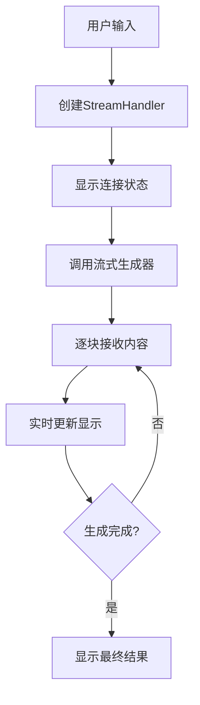

# 流式响应功能说明

## 概述

小红书文案生成智能体现已支持**流式响应**功能，让用户可以实时看到AI生成内容的过程，提供更好的交互体验。

## ✨ 主要特性

### 1. 文案生成流式显示
- 🎯 实时显示生成进度
- 📝 逐字逐句显示生成内容
- ✨ 智能状态提示

### 2. 对话流式响应
- 💬 流式对话模式
- 🤔 实时思考过程显示
- 🌊 平滑的文字流动效果

### 3. 内容优化流式处理
- 🎯 实时优化过程展示
- ✨ 优化建议逐步显示
- 📊 优化进度可视化

## 🔧 配置选项

在Web界面的侧边栏中，用户可以控制以下流式响应设置：

### 启用流式响应
- ✅ **开启**：实时显示生成过程，提供最佳交互体验
- ❌ **关闭**：等待完整生成后一次性显示结果

### 启用思考模式
- ✅ **开启**：模型会显示思考过程（仅在流式模式下生效）
- ❌ **关闭**：直接显示最终结果

## 🚀 使用方法

### 1. 启动Web界面

```bash
# 安装依赖
pip install -r requirements.txt

# 启动Web界面
python start_web.py
```

### 2. 配置流式响应

1. 在侧边栏中找到"⚙️ 设置"
2. 勾选"启用流式响应"复选框
3. 可选择是否启用"思考模式"
4. 配置会实时生效

### 3. 体验流式功能

#### 文案生成
1. 填写生成参数（分类、主题、语气等）
2. 点击"🚀 生成文案"
3. 观察实时生成过程：
   - 🎯 正在连接模型...
   - 📝 开始生成文案...
   - ✨ 实时生成中...（显示逐步生成的内容）
   - ✨ 生成完成

#### 智能对话
1. 在"💬 智能对话"标签页中输入问题
2. 点击"发送"
3. 观察流式对话过程：
   - 🤔 正在思考您的问题...
   - 💬 开始回复...
   - 实时显示回复内容

#### 内容优化
1. 生成文案后点击"🎯 优化此文案"
2. 观察流式优化过程：
   - 🎯 分析原文案...
   - ✨ 开始优化...
   - 🎯 实时优化中...（显示优化内容）
   - 🎯 优化完成

## 💡 技术实现

### 核心组件

1. **StreamHandler类**：负责管理Streamlit中的流式显示
2. **生成器方法**：
   - `generate_complete_post_stream()` - 流式文案生成
   - `chat_stream()` - 流式对话
   - `optimize_content_stream()` - 流式内容优化

### 流式生成流程



## 📊 性能优化

- **延迟控制**：0.05秒的显示间隔，平衡流畅度和性能
- **内容缓存**：避免重复渲染相同内容
- **状态管理**：智能的占位符管理和清理

## 🎯 用户体验提升

1. **即时反馈**：用户立即知道系统正在工作
2. **进度可视化**：清楚了解生成进度
3. **平滑交互**：避免长时间等待的焦虑
4. **智能提示**：不同阶段的状态说明

## ⚙️ 兼容性说明

- **流式模式**：适合需要实时反馈的场景
- **标准模式**：适合网络环境不稳定或偏好一次性显示的用户
- **自动切换**：用户可以随时在设置中切换模式

## 🔍 故障排除

### 流式显示异常
- 检查网络连接
- 确认Ollama服务正常运行
- 尝试关闭流式模式使用标准模式

### 显示卡顿
- 适当增加显示延迟时间
- 检查系统资源使用情况
- 关闭不必要的浏览器标签页

## 📈 未来计划

- [ ] 支持自定义流式显示速度
- [ ] 添加生成进度百分比显示
- [ ] 支持暂停/恢复流式生成
- [ ] 添加流式生成的音效提示
- [ ] 支持多路流式生成并发显示 